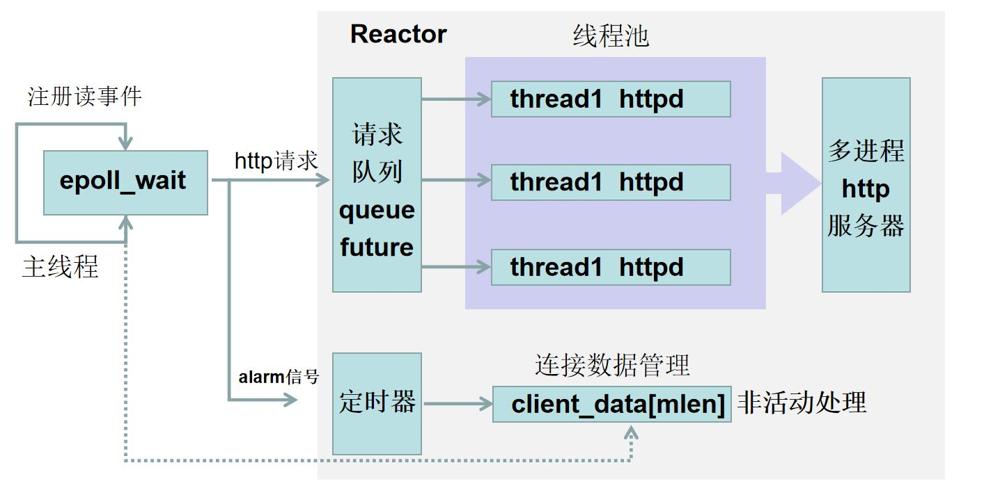
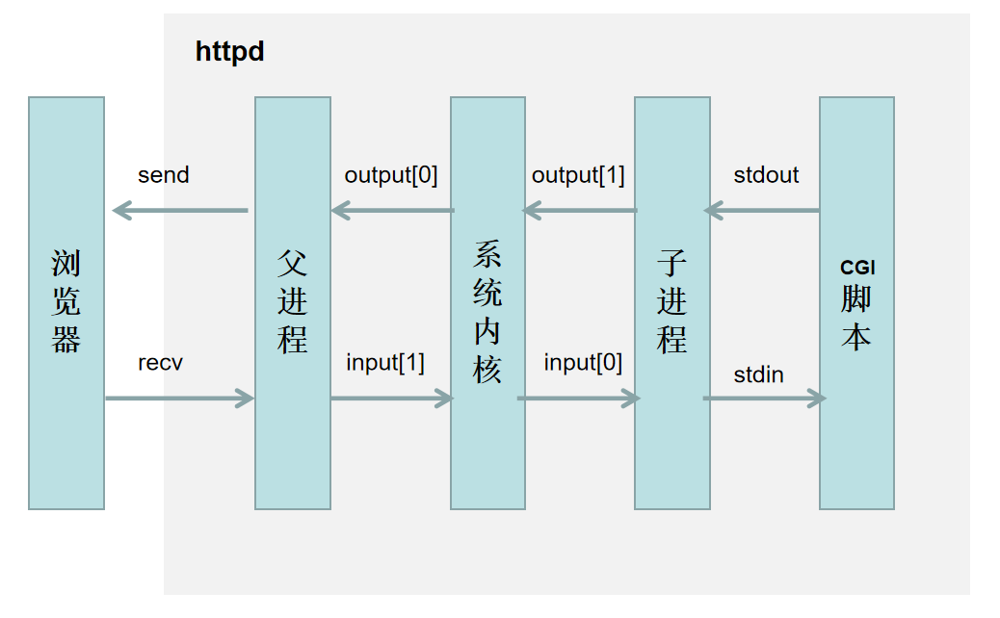
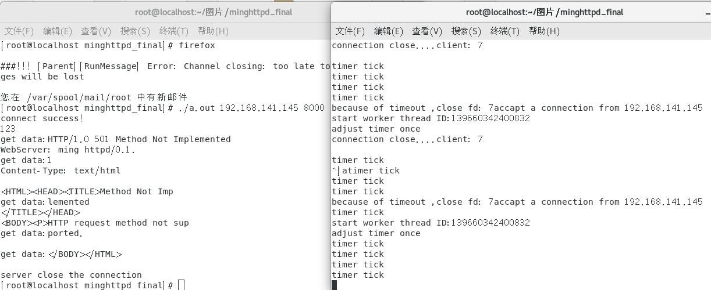
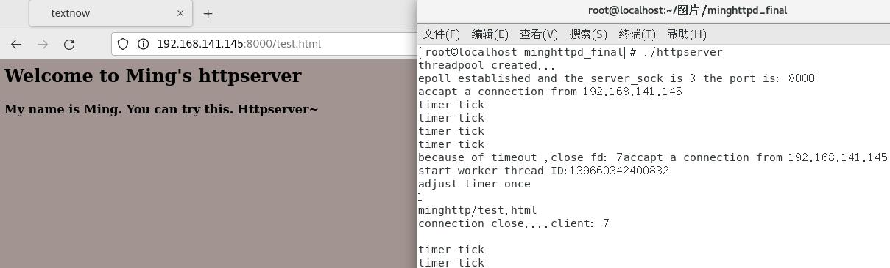
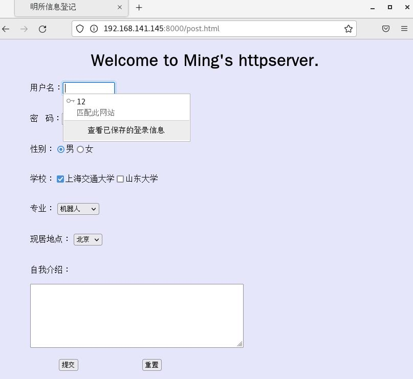
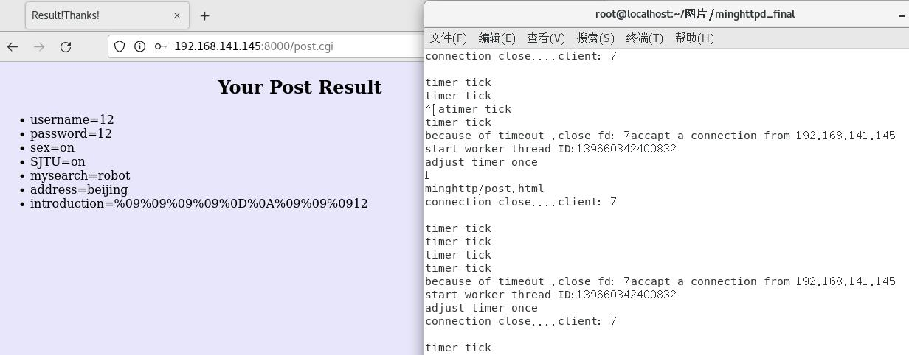
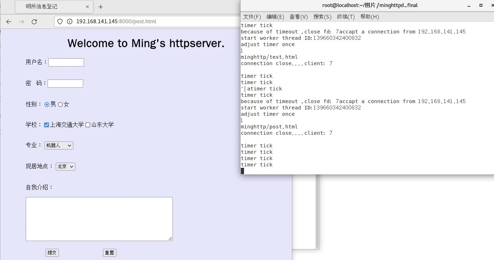

# final_minghttpd
<h1 align="center"> 改进的C++HTTP服务器 </h1>

### 1、技术架构
&emsp;&emsp;**本项目实现了基于Epoll管理连接、基于定时器处理非活动连接、基于线程池实现Reactor模式、基于cgi脚本处理http请求结果的HTTP服务器。主要框架如下：**\

### 2、模块介绍
&emsp;&emsp;**1）主线程实现eventLoop**：主线程基于Reactor并通过Epoll管理，采用ET工作模式进行事件触发，事件注册包括监听、管道监控、读信息监控；\
&emsp;&emsp;**2）定时器处理非活动连接**：\
&emsp;&emsp;&emsp;&emsp;**①基于升序链表的定时器**：将每个需要监控的连接注册为一个时间结点，每个结点包括双向指针以及期待的时间和回调函数指针；包含添加、删除以及调整结点；回调函数主要实现对当前连接的close；\
&emsp;&emsp;&emsp;&emsp;**②基于信号和管道的定时事件处理**：建立监听数据集（新连接会加入一个数据集和时间结点，新信息读入会读取数据集并修改时间结点），基于sigaction形式实现对信号和信号处理函数的绑定，信号处理函数向管道发送信号消息，主线程监听到管道消息读入后判断信号类别，并进行关闭连接操作。\
&emsp;&emsp;**3）Http响应处理**：基于tinyhttpd进行修改，捕获GET、POST方法，基于cgi脚本(python撰写)实现post请求响应，基于多进程机制并通过双通道实现进程间通信，并用waitpid进行子进程管控。具体结构如下图所示：\
 \
&emsp;&emsp;**4）线程池**：基于C++的生产者消费者模式的并发开发，具体技术运用如下：\
&emsp;&emsp;&emsp;&emsp;**①线程池底层结构**：线程池创建相当于消费者，队列添加相当于生产者，通过vector维护线程池，通过queue<function<>>维护任务队列；构造函数实现线程池创建并开始运行，enqueue函数实现消息队列，通过future实现异步工作的lambda函数的传递；\
&emsp;&emsp;&emsp;&emsp;**②同步机制实现**：基于unique_lock以及condition_variable实现同步和互斥，符合RAII原则；\
&emsp;&emsp;**5）简单客户端**：（可以通过浏览器进行服务端访问，也可以通过该客户端实现交互以及非活动连接处理的测试）\
&emsp;&emsp;&emsp;&emsp;**①基于POLL的IO复用**：对管道和连接进行事件监听和处理；\
&emsp;&emsp;&emsp;&emsp;**②基于双管道的简易CGI实现**：修改stdin的定向为管道写端，实现终端对客户端的直接输入和对服务端的发送；\
&emsp;&emsp;**6）改进方向**：待进行压力测试并提高抗压性能、可处理的HTTP请求较为简单（数据体的处理还待增加以及CGI功能的完善）、内存池。
### 3、编译使用
&emsp;&emsp;**服务端**：进入linux系统后，进入当前文件夹，首先修改可执行权限，然后通过CMake编译执行即可：
~~~c
cd  minghttp
chmod 600 test.html
chmod 600 post.html
chmod +X post.cgi
cd ..
cmake .
make
./httpserver
~~~
&emsp;&emsp;**客户端**：一方面可以通过浏览器直接进行服务器访问，一方面可以使用自己创建的客户端进行连接和消息互传（使用方案如下）：
~~~c
g++ simclient.cpp
./a.out ip port
~~~

### 4、呈现效果
&emsp;&emsp;上一部分的图片已经展现定时器处理非活动连接的效果；\
&emsp;&emsp;1）项目默认端口号为8000，ip地址需要通过ifconfig进行查看；\
&emsp;&emsp;2）将ip和端口号进行替换输入，如下输入后可以得到如下界面：\
\
&emsp;&emsp;3）POST的界面信息：\
\
&emsp;&emsp;4）POST的CGI脚本回显，基于python进行撰写，内容传输为html语言：\
\
&emsp;&emsp;5）定时器的相关讯息也可以得到：可以看到5秒信号的定时器信息输出：\

### 5、参考借鉴
&emsp;1）线程池参考学习：https://github.com/progschj/ThreadPool \
&emsp;2）tinyhttpd：https://sourceforge.net/projects/tiny-httpd/ \
&emsp;3）其他源码学习：https://github.com/fltflt/Tinyhttpd_with_threadpool_epoll.git \

作者：交大小明

日期：2022年

